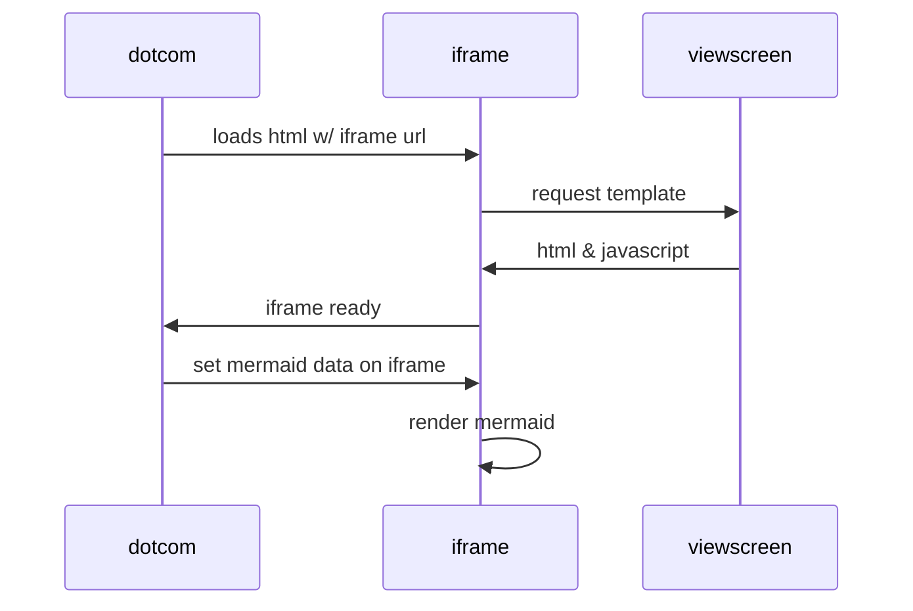

# restinfo-app-maven
Sample application that uses `rest-info` as `maven-` or `gradle-` library via `maven` build-tool.

Sample graph-diagram:

```mermaid
  graph TD;
      A-->B;
      A-->C;
      B-->D;
      C-->D;
```

Sample sequence-diagram:

```mermaid
sequenceDiagram
    participant dotcom
    participant iframe
    participant viewscreen
    dotcom->>iframe: loads html w/ iframe url
    iframe->>viewscreen: request template
    viewscreen->>iframe: html & javascript
    iframe->>dotcom: iframe ready
    dotcom->>iframe: set mermaid data on iframe
    iframe->>iframe: render mermaid
```
